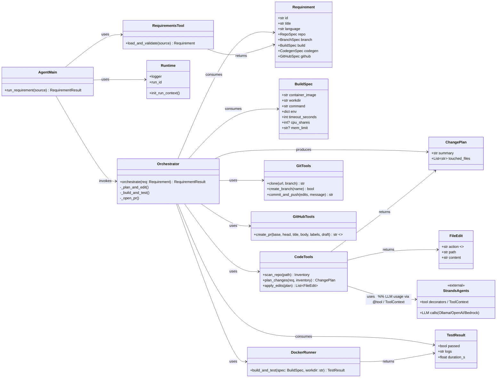
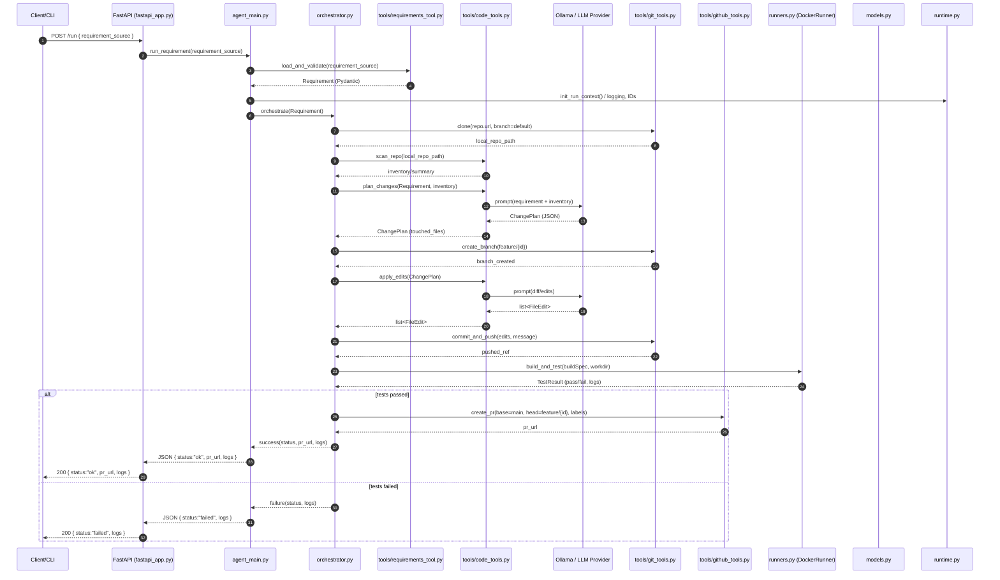

# Strands CodeOps Agent (Python) — with Async FastAPI

End-to-end automation from a **requirement template → PR**, exposed via an async FastAPI:

- Parse requirement YAML
- Clone repo, create feature branch
- Plan and generate code + tests via LLM (structured output)
- Optional codebase search tool for additional context to generation
- Build & test in ephemeral Docker runner
- Commit, push, and open a PR
- Return a structured response (status, pr_url, logs)


## Project Structure
```
strands-demo
├── agent_main.py
├── app
│   ├── __init__.py
│   ├── models.py
│   ├── orchestrator.py
│   ├── runners.py
│   ├── runtime.py
│   ├── tools
│   │   ├── code_tools.py
│   │   ├── git_tools.py
│   │   ├── github_tools.py
│   │   ├── requirements_tool.py
│   │   └── search_context.py
│   └── utils.py
├── docker-compose.yml
├── Dockerfile
├── fastapi_app.py
├── jobs/
├── LICENSE
├── README.md
├── requirements.txt
├── templates
│   ├── requirement.example.yaml
│   └── requirement.write-tests.yaml
└── tests
    └── Dockerfile.polytest

```
## Class Diagram


## Sequence Diagrams


# Strands Demo Project Architecture

The **Strands Demo** project is an autonomous code-ops agent built on [Strands Agents](https://strandsagents.com/).  
It takes structured requirements (YAML), edits repositories, runs builds/tests inside Docker, and opens GitHub PRs automatically.

---

# Strands Demo Project Architecture

The **Strands Demo** project is an autonomous code-ops agent built on [Strands Agents](https://strandsagents.com/).  
It takes structured requirements (YAML), edits repositories, runs builds/tests inside Docker, and opens GitHub PRs automatically.

---


---

# Option B — With Mermaid init (useful if your renderer needs it)

```markdown
# Strands Demo Project Architecture

# Strands Demo Project Architecture

## High-Level Workflow

flowchart TD
    A["Requirement YAML"] --> B["FastAPI Agent (fastapi_app.py)"]
    B --> C["Orchestrator (agent_main.py / orchestrator.py)"]
    C --> D["Code Tools (code_tools.py)"]
    C --> E["DockerRunner (runners.py)"]
    C --> F["GitHub Tools (git_tools.py + github_tools.py)"]

    E -->|"BuildSpec"| H["Jobs Workspace"]
    D --> H
    F --> G["GitHub Repo (branch + PR)"]

    subgraph Config_Infra
        I["Dockerfile / docker-compose.yml"]
        J["requirements.txt"]
        K["templates/"]
    end

    I --> E
    J --> E
    K --> D


## REST API

- `GET /health` → `{"ok": true}`
- `POST /run` → body: `{ "requirement_source": "<path-or-raw-YAML>" }`

Example:
```bash
curl -sS localhost:8088/run -X POST -H "Content-Type: application/json"       -d '{"requirement_source":"templates/requirement.example.yaml"}' | jq .
```

## Quick start

```bash
cp .env.example .env
# configure STRANDS_MODEL_PROVIDER + GITHUB_TOKEN

docker compose up --build -d
# then call the API as shown above
```

## Notes
- Build/test isolation via Docker runner; configure image+command in the template.
- Optional OpenTelemetry export if `OTEL_EXPORTER_OTLP_ENDPOINT` is set.
- Swap providers: Bedrock (default with AWS creds), OpenAI, or local Ollama.
- Configure search-context limits via `SEARCH_CONTEXT_MAX_RESULTS`,
  `SEARCH_CONTEXT_MAX_CHARS`, and `SEARCH_CONTEXT_LINES` (see `.env.example`).
